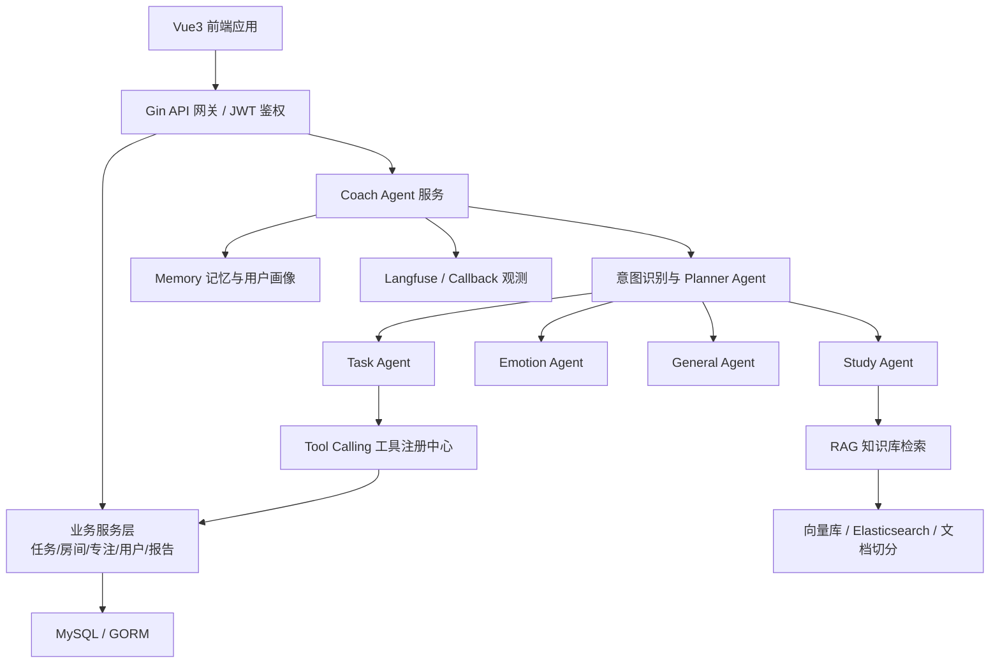
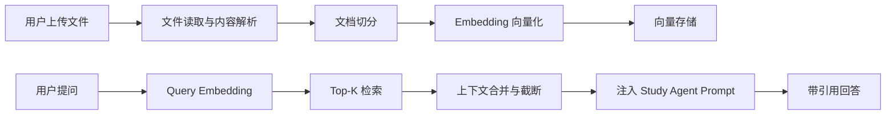

**Tomato Study Room 智能学习教练 Agent 系统**。

# 《Agent 项目中期报告》

## 1. 项目背景与研究意义

随着大语言模型、RAG 检索增强生成、Tool Calling、智能体工作流编排等技术快速发展，传统学习管理系统正在从“工具型系统”向“智能陪伴型系统”演进。传统番茄钟、任务清单、学习资料管理平台通常只能完成计时、记录、展示等基础功能，缺乏对学习者状态、学习目标、知识问题和长期成长轨迹的理解能力。

本项目以“AI 学习教练 Agent”为核心，围绕学习计划制定、任务管理、知识库问答、情绪陪伴、专注记录、学习报告生成等场景，构建一个面向学生和自我提升人群的智能学习辅助系统。系统不仅提供 Web 应用功能，还引入多 Agent 协同、RAG 知识库、Prompt Engineering、工具调用、长期记忆与用户画像等 Agent 工程能力，使学习系统具备主动分析、智能规划、个性化响应和持续优化能力。

项目研究意义主要体现在三个方面：

| 维度 | 研究意义 |
|---|---|
| 教育智能化 | 将大模型能力嵌入学习任务管理与知识问答流程，提升学习效率 |
| Agent 工程实践 | 从单轮对话升级为可规划、可调用工具、可记忆、可检索的智能体系统 |
| 应用落地价值 | 面向真实用户场景，形成前后端、数据库、AI 服务、知识库一体化工程方案 |

## 2. 项目目标与需求分析

本项目目标是构建一个“学习场景下的多能力智能 Agent 平台”，支持用户在学习过程中获得任务管理、资料问答、专注陪伴、学习复盘和个性化建议。

核心目标包括：

1. 构建基于 Go + Gin + Vue3 的前后端分离学习平台。
2. 集成 Eino Agent 框架，实现 Agent 工作流编排与流式对话。
3. 设计任务型、学习型、情绪陪伴型、通用型等多类 Agent。
4. 实现 RAG 知识库能力，支持用户上传资料并基于资料问答。
5. 支持 Tool Calling，使 Agent 可调用任务、知识库、用户画像、学习报告等业务工具。
6. 引入长期记忆、用户画像和历史摘要，增强 Agent 个性化能力。
7. 建立工程化测试、配置、日志、Docker 部署和观测机制。

需求可分为四类：

| 需求类别 | 具体内容 |
|---|---|
| 基础业务需求 | 登录注册、学习房间、任务管理、好友、专注记录、学习报告 |
| Agent 智能需求 | 智能对话、意图识别、多 Agent 调度、任务规划、情绪陪伴 |
| 知识增强需求 | 文档上传、知识库检索、引用溯源、知识问答 |
| 工程落地需求 | JWT 鉴权、MySQL 持久化、SSE 流式返回、日志、测试、Docker 部署 |

## 3. Agent 系统整体架构

系统整体采用“前端交互层 + 后端业务服务层 + Agent 编排层 + 工具与知识层 + 数据持久层”的分层架构。

当前架构具备以下特点：

| 架构层 | 技术实现 |
|---|---|
| 前端层 | Vue3、Vue Router、Axios、知识库页、学习报告页、桌宠对话组件 |
| 接口层 | Gin、REST API、SSE 流式响应、JWT 鉴权 |
| Agent 层 | CloudWeGo Eino、ReAct Graph、Planner-Orchestrator |
| 工具层 | 任务工具、知识库工具、用户工具、学习报告工具、文件系统工具 |
| 知识层 | RAG Pipeline、文本切分、向量检索、上下文构建、引用管理 |
| 数据层 | MySQL、GORM、实体模型、Repository/Service 分层 |
| 工程层 | Docker、配置文件、日志、测试用例、Langfuse 回调观测 |

## 4. 核心技术方案

### 4.1 基于 Eino 的 Agent 工作流

项目使用 CloudWeGo Eino 作为 Agent 工作流框架，核心实现包括：

- 使用 `compose.NewGraph` 构建 Agent 执行图。
- 通过 ReAct 模式实现“模型推理 -> 工具调用 -> 继续推理”的闭环。
- 使用 `StreamReader` 和 `StreamWriter` 支持流式输出。
- 使用 Planner Agent 将复杂用户请求拆解为多个原子步骤。
- 使用 Orchestrator 根据步骤依赖构建动态 DAG，并调度不同 Agent 执行。

该方案使系统从普通 ChatBot 升级为具备“规划、执行、调用工具、合成结果”的 Agent 系统。

### 4.2 Fast / Thinking 双路径响应机制

系统设计了两种对话模式：

| 模式 | 目标 | 技术策略 |
|---|---|---|
| Fast 模式 | 快速响应、降低 Token 成本 | 使用轻量模型进行意图识别，直接路由到对应 Agent |
| Thinking 模式 | 复杂任务处理、多步骤推理 | 使用 Planner Agent 生成执行计划，再由 Orchestrator 调度执行 |

这一设计兼顾了用户体验与成本控制，适合真实产品场景中的高频交互。

### 4.3 ReAct Tool Calling 机制

项目封装了 ReAct Graph，支持模型根据上下文自主产生工具调用，并将工具执行结果写回对话历史，再由模型继续生成最终回答。当前实现中包含：

- 工具注册中心。
- 工具语义检索。
- 工具超时控制。
- 用户 ID 注入。
- 工具结果截断。
- 工具调用失败兜底。

这体现了较强的 Agent 工程安全意识和可控性。

## 5. 已完成模块

截至中期阶段，项目已完成以下主要模块：

| 模块 | 完成情况 | 说明 |
|---|---:|---|
| 用户认证模块 | 已完成 | 登录、注册、JWT 鉴权、用户信息接口 |
| 学习房间模块 | 已完成 | 创建房间、加入房间、成员管理、个人学习房间 |
| 任务管理模块 | 已完成 | 任务创建、查询、编辑、删除、完成 |
| 专注记录模块 | 已完成 | 开始/结束专注、记录查询、日报/周报/月报接口 |
| AI Coach 对话模块 | 已完成 | SSE 流式对话、会话管理、历史保存 |
| 多 Agent 模块 | 已完成主体 | Task/Study/Emotion/General/Planner Agent |
| RAG 知识库模块 | 已完成主体 | 文件上传、知识列表、检索增强、上下文构建 |
| 记忆与画像模块 | 已完成主体 | 对话历史压缩、用户画像、事实提取、情景记忆 |
| 学习报告模块 | 已完成主体 | 日报生成与重新生成 |
| 前端页面模块 | 已完成主体 | 登录、首页、学习房间、任务、知识库、报告、个人中心 |
| 工程测试模块 | 部分完成 | 单元测试、Agent 测试、RAG 测试、手工测试文档 |

## 6. 当前实现效果

当前系统已经具备较完整的端到端运行能力。用户可以通过前端完成登录、进入学习房间、管理任务、上传知识资料，并与 AI 学习教练进行流式对话。

在 AI 交互方面，系统能够根据用户问题自动识别意图。例如：

| 用户输入类型 | 系统行为 |
|---|---|
| “帮我创建一个英语背单词任务” | 路由至 Task Agent，调用任务工具 |
| “这份资料里的概念帮我解释一下” | 路由至 Study Agent，结合 RAG 知识库回答 |
| “我今天学不下去了” | 路由至 Emotion Agent，进行情绪陪伴 |
| “帮我总结一下今天学习情况” | 调用学习报告或任务总结相关能力 |

在复杂模式下，系统可通过 Planner Agent 将用户请求拆解为多个步骤，并由 Orchestrator 调度执行。例如，“帮我分析今天任务完成情况，并给出明天学习计划”可以拆解为任务查询、学习报告分析、计划建议生成等步骤。

## 7. 多 Agent 协同机制

项目已经实现多 Agent 协同框架，主要包括：

| Agent | 职责 |
|---|---|
| Planner Agent | 复杂任务拆解，生成 JSON 格式执行计划 |
| Task Agent | 处理任务创建、查询、完成、学习报告相关任务 |
| Study Agent | 处理知识问答、课程资料解释、学习内容辅导 |
| Emotion Agent | 处理情绪陪伴、压力缓解、学习状态安抚 |
| General Agent | 处理通用问答和无法归类的请求 |

协同流程如下：

1. 用户发送请求。
2. 系统判断当前为 Fast 模式或 Thinking 模式。
3. Fast 模式直接进行意图识别并路由。
4. Thinking 模式由 Planner Agent 生成多步骤执行计划。
5. Orchestrator 根据依赖关系构建 DAG。
6. 不同 Agent 执行子任务。
7. 子任务结果写入 Scratchpad。
8. 系统汇总输出，并记录 Token 使用情况。

技术亮点在于：项目不是简单地硬编码多个角色，而是引入了计划生成、动态图编排、上下文压缩、结果汇总和 Token 统计，具备较高的 Agent 工程完整度。

## 8. Prompt Engineering 设计

项目已将 Prompt 配置独立维护在 `prompts.yaml` 中，便于后续迭代和实验。Prompt 设计体现出角色分工、输出约束和安全边界。

主要设计包括：

| Prompt 类型 | 设计重点 |
|---|---|
| 意图识别 Prompt | 要求只输出 emotion/task/study/general 单词，降低解析复杂度 |
| Task Agent Prompt | 强调任务操作规范、禁止泄露数据库 ID、创建/完成操作简洁确认 |
| Study Agent Prompt | 强调知识库引用、资料来源一致性、禁止编造来源 |
| Emotion Agent Prompt | 强调同理心优先、避免说教、适合学习陪伴场景 |
| General Agent Prompt | 处理通用问题，同时保持用户 ID 和工具名称隐藏 |
| Planner Prompt | 要求输出合法 JSON，包含 step id、agent、query、dependencies |

技术亮点：

- 使用角色化 Prompt 明确 Agent 能力边界。
- 对输出格式进行强约束，便于后端解析。
- 对安全风险进行约束，如禁止泄露数据库数字 ID。
- 对 RAG 引用格式进行规范，提升可解释性。
- 针对多步骤任务设计结构化 Planner 输出。

## 9. RAG / 知识库设计

项目已实现 RAG Pipeline，支持用户上传知识文件并用于学习问答。核心流程包括：

当前 RAG 模块的工程特点包括：

| 能力 | 实现说明 |
|---|---|
| 文档切分 | 使用递归切分，控制 chunk 长度与 overlap |
| 向量检索 | 基于 Embedding 和向量相似度进行 Top-K 召回 |
| 上下文构建 | 按文件来源分组，合并相邻片段，限制最大上下文长度 |
| 引用溯源 | 要求回答末尾输出参考资料来源 |
| 可扩展存储 | 已包含 Elasticsearch 相关实现基础 |
| 查询增强 | SimpleRAG 设计中预留查询重写、混合检索、reranker 能力 |

该模块使系统具备“基于个人资料学习”的能力，是项目区别于普通通用聊天系统的重要亮点。

## 10. Tool Calling 机制

项目中的工具调用机制主要由工具注册中心和 ReAct Graph 共同完成。

当前已实现或规划接入的工具包括：

| 工具类型 | 作用 |
|---|---|
| Task Tool | 创建、查询、完成学习任务 |
| Knowledge Tool | 查询知识库、辅助资料问答 |
| User Tool | 获取或更新用户画像相关信息 |
| Report Tool | 查询学习日报、生成学习总结 |
| StudyPlan Tool | 辅助学习计划生成 |
| FileSystem Tool | 文件系统相关扩展能力 |
| Skill Tool | 接入项目内技能文档，如学习计划、情绪调节等 |

Tool Calling 的工程控制措施包括：

- 使用语义工具注册表，根据用户问题召回相关工具。
- 工具调用时注入 `user_id`，避免越权访问。
- 工具执行设置 20 秒超时，避免 Agent 卡死。
- 工具结果进行截断，降低上下文膨胀风险。
- 工具失败时写入 Tool Message，使模型具备继续恢复能力。

## 11. 性能测试与评估

当前项目已包含一定测试基础，包括 Agent、RAG、Prompt、Memory、工具安全、用户服务、任务总结等测试文件。测试覆盖方向如下：

| 测试方向 | 当前覆盖 |
|---|---|
| Agent 路由与生成 | TaskAgent、EmotionAgent、Coach Graph |
| RAG 能力 | 文档切分、上下文合并、专业问题检索 |
| Memory 能力 | 历史压缩、事实提取、异常 JSON 处理 |
| Tool 安全 | 工具超时、Zero Trust 用户 ID 注入 |
| 业务服务 | 用户注册、密码加密、JWT、隐私设置、好友关系 |
| 任务能力 | 任务摘要生成 |

建议中期汇报中采用以下评估指标：

| 评估维度 | 指标 |
|---|---|
| 响应性能 | 首 Token 延迟、完整响应耗时、SSE 稳定性 |
| Agent 准确性 | 意图识别准确率、工具调用成功率、计划拆解合理率 |
| RAG 效果 | 召回准确率、引用正确率、答案忠实度 |
| 工程质量 | 单元测试通过率、接口可用率、异常恢复能力 |
| 用户体验 | 对话自然度、任务操作成功率、知识问答满意度 |

当前阶段建议将测试结论表述为：系统已完成核心链路验证，具备基础可用性；下一阶段需补充自动化评测集、压力测试和真实用户试用反馈。

## 12. 当前问题与风险

| 风险类别 | 当前问题 | 应对策略 |
|---|---|---|
| Agent 稳定性 | 多步骤规划可能出现 JSON 格式错误或依赖关系不合理 | 增加 JSON Schema 校验、计划修复器和降级路径 |
| RAG 准确性 | 检索结果可能不完整，引用格式可能不稳定 | 引入 reranker、答案引用校验、知识片段质量评分 |
| 成本与性能 | Thinking 模式多 Agent 调度 Token 消耗较高 | 优化 Fast/Thinking 路由，增加摘要缓存和工具结果缓存 |
| 数据安全 | 用户资料、任务、知识库涉及隐私数据 | 加强权限校验、文件隔离、敏感字段脱敏 |
| 工程部署 | 依赖 MySQL、模型 API、Embedding 服务、向量库 | 完善 Docker Compose、健康检查和环境配置文档 |
| 前端体验 | Agent 流式状态、工具执行状态可视化仍可增强 | 增加思考状态、工具调用提示、引用卡片展示 |

## 13. 下一阶段研发计划

下一阶段建议围绕“稳定性、可评测、可展示、可部署”推进。

| 阶段 | 研发任务 | 预期成果 |
|---|---|---|
| 第 1 阶段 | 完善 Agent 执行可靠性 | Planner JSON 校验、失败重试、工具调用日志 |
| 第 2 阶段 | 强化 RAG 效果 | 引入 reranker、知识引用校验、文档预览增强 |
| 第 3 阶段 | 优化用户画像与记忆 | 用户画像可视化、画像锁定策略、记忆召回效果评估 |
| 第 4 阶段 | 完善前端交互 | Agent 对话状态、知识引用展示、学习报告可视化 |
| 第 5 阶段 | 构建评测体系 | 意图识别测试集、RAG 问答集、工具调用成功率统计 |
| 第 6 阶段 | 部署与汇报准备 | Docker 一键启动、演示脚本、答辩 PPT、项目视频 |

建议重点交付物：

1. 一套可演示的完整学习流程：登录 -> 上传资料 -> 创建任务 -> 专注学习 -> Agent 问答 -> 生成日报。
2. 一组 Agent 能力案例：任务管理、知识问答、情绪陪伴、多步骤规划。
3. 一份评测表：包含响应耗时、工具调用成功率、RAG 引用准确率等数据。
4. 一份架构图和技术亮点 PPT 页面。

## 14. 项目总结

本项目围绕 AI Agent 在学习辅助场景中的工程化落地，已经完成从基础 Web 系统到智能 Agent 系统的主体建设。项目不仅实现了任务管理、学习房间、专注记录、知识库和学习报告等业务功能，还进一步集成了 Eino Agent 工作流、多 Agent 协同、RAG 检索增强、Tool Calling、长期记忆、用户画像和流式对话等关键技术。

从中期成果来看，项目已具备较高的技术完整性和展示价值：既有面向用户的前端交互界面，也有后端服务、数据库、Agent 编排、工具调用、知识库检索和测试体系支撑。其创新点不在于单一聊天功能，而在于将大模型能力嵌入真实学习流程，使 Agent 能够理解用户状态、调用业务工具、结合个人资料回答问题，并围绕长期学习目标持续提供辅助。

后续项目将重点提升 Agent 稳定性、RAG 准确性、评测体系和部署体验，进一步形成可答辩、可演示、可复用、可扩展的 AI Agent 学习教练系统。